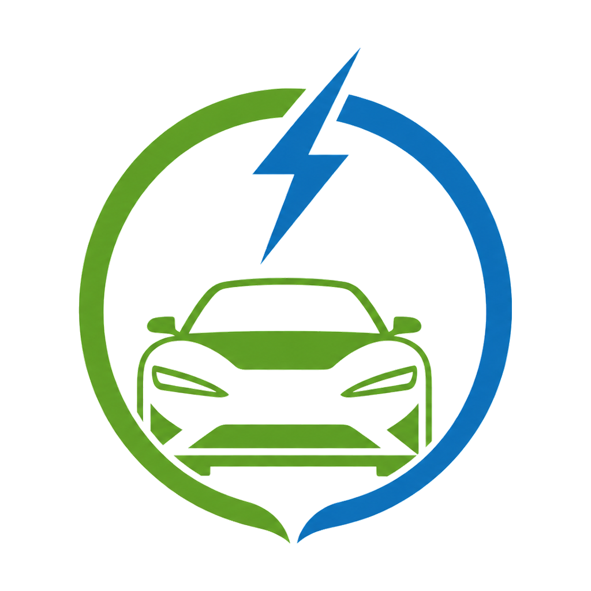

  

<h1 align="center">Glide — your personal driving coach</h1>

  Drive smoother. Waste less energy. Climb the global leaderboard. 
  <b>Free · Android · No account needed · Works with EV, Hybrid and petrol cars</b>

  <a href="https://github.com/evdriver-tech/glide-announcements/releases/latest"><b>⬇ Download the latest APK</b></a>
  &nbsp;·&nbsp;
  <a href="https://glide-leaderboard.netlify.app"><b>🌍 Global Leaderboard</b></a>

---

## What it does

Put your phone in a mount (or your pocket), press **Record**, and drive. Glide uses your phone's motion sensors and GPS to score how smoothly you drive:

- 🎯 **Efficiency** — how gently you accelerate
- 👀 **Anticipation** — braking early vs. braking late
- 🔄 **Smooth turns** — cornering without throwing passengers around
- 📈 **Steadiness** — keeping a calm, even pace
- ⚡ **Energy recovery** — regen braking quality (EV / Hybrid)

After each drive you get a score per category, a map of every incident, and tips on what to improve. Smooth driving is safer, more comfortable for passengers, and measurably cheaper — whether you pay in kWh or in fuel.

## 🌍 The Global Leaderboard

Log **160 km** and you unlock the option to share your all-time scores with the world — first name only, no account, no tracking. See how you rank: **[glide-leaderboard.netlify.app](https://glide-leaderboard.netlify.app)**

## Installing

1. Download the APK from the [latest release](https://github.com/evdriver-tech/glide-announcements/releases/latest) on your Android phone.
2. Open it — Android will ask you to allow installs from your browser. Allow it (one-time).
3. Open Glide, grant location + motion permissions, and record your first drive.

> Glide records only while you press Record. Your drives stay on your phone; nothing is uploaded unless you choose to submit your score to the leaderboard.

## Updates

Glide checks this repository for announcements and tells you in-app when a new version is out.
